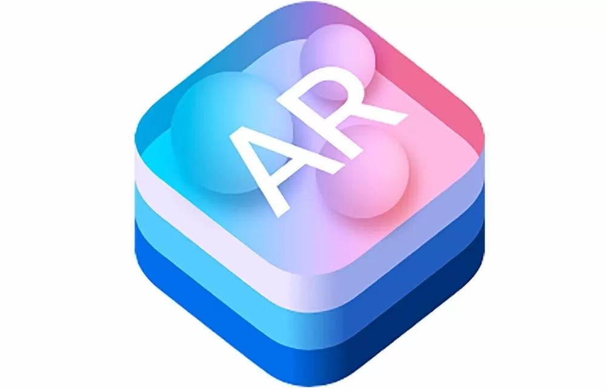

# Primeros pasos con ARKIT

## ¿Qué es ARKIT ?

> Arkit es un framework que nos ayuda a crear realidad aumentada en nuestras aplicaciones iOS. ARKit utiliza una técnica llamada Odometría Visual Inercial (VIO) la cual combina  información de los sensores de movimiento junto con la cámara del dispositivo.

Para este ejemplo se ha escogido la tecnología SceneKit la cual es enfocada para objetos en 3D. Si escogemos un template propio de ARKIT en ios, el ejemplo nos muestra un avioncito en nuestra realidad.

El archivo para entender lo que esta realizando este codigo es el siguiente **ViewController.swift**

Primero se debe definir la clase *ViewController* como:

> `ARSCNViewDelegate :`
> `class ViewController: UIViewController, ARSCNViewDelegate { } `

Ahora se necesita crear una escena para mostrar una imagen virtual. Para esto necesitas crear an *IBOutlet*. El nombre *IBOutlet* puede ser cualquiera que usted desea. Luego la plantilla de la aplicacion de realidad virtual *IBOutlet sceneView* nombra a un objeto *ARSCNView*

> ` @IBOutlet var sceneView: ARSCNView!`

Dentro del methodo *viewDidLoad* se define cuatro elementos. 

* Definir *view's delegate*:
> `sceneView.delegate = self`

* En este caso se va a mostrar estadísticas en la pantalla. El siguiente comando muestra el número de frames por segundo (fps)
>`sceneView.showsStatistics = true`

* Definir la imagen real que se va a mostrar en la realidad aumentada. Es importante tener en cuenta que la escena está definida por el *IBOutlet* la cual toma el nombre de *sceneView*
>`let scene = SCNScene(named: "art.scnassets/ship.scn")!`

Si usted da click en la carpeta *art.scnassets* en **Xcode** se puede ver dos archivos gráficos llamados *ship.scn* y *texture.png*

El archivo *ship.scn* (define la forma 3D del avión) representa una imagen de SceneKit. Tambien se puede utilizar otro tipo de archivos como COLLADA (Actividad de diseño COLL), que tiene la extensión de archivo *.dae.*.
Por otro lado el archivo *texture.png* define la imagen que se aplica en la imagen *ship.scn* para mostrar diferentes colores y patrones.

* Una vez definida la imagen 3D en el nombre de la variable **scene**, finalmente se debe colocar esta imagen 3D en la vista de la escena real: 
>`sceneView.scene = scene`

Por otro lado, en el método *viewWillAppear*, usted necesita añadir dos líneas adicionales. La primera línea activa el seguimiento del dispositivo iOS para medir la posición y el ángulo en el que apunta la cámara.
>`let configuration = ARWorldTrackingConfiguration()`

La segunda línea ejecuta la sesión real de realidad aumentada
>`sceneView.session.run(configuration)`

