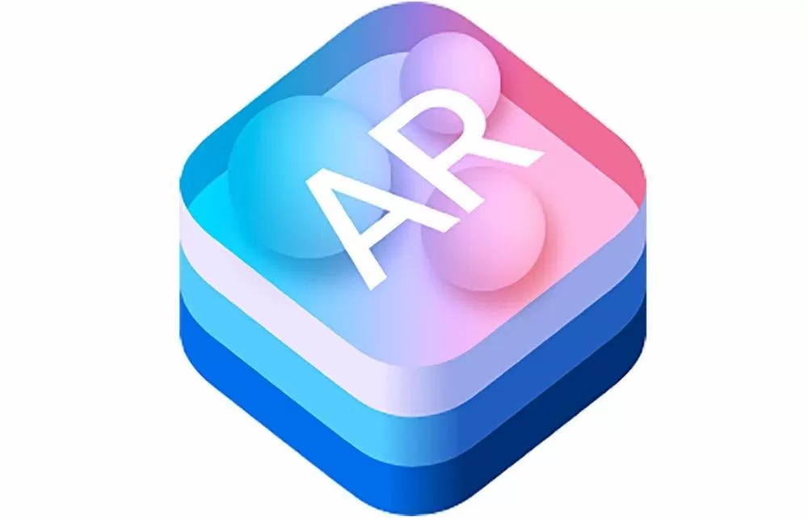
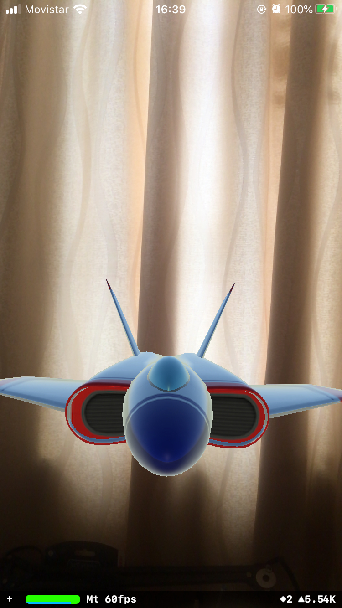

# Primeros pasos con ARKIT

## ¿Qué es ARKIT ?

> Arkit es un framework que nos ayuda a crear realidad aumentada en nuestras aplicaciones iOS. ARKit utiliza una técnica llamada Odometría Visual Inercial (VIO) la cual combina  información de los sensores de movimiento junto con la cámara del dispositivo.

Para este ejemplo se ha escogido la tecnología SceneKit la cual es enfocada para objetos en 3D. Si escogemos un template propio de ARKIT en ios, el ejemplo nos muestra un avioncito en nuestra realidad.

